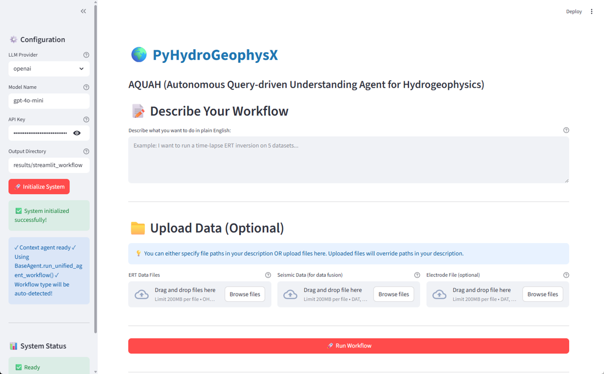

# GAGAW Hydrogeophysics

## AQUAH: Autonomous Query-driven Understanding Agent for Hydrogeophysics

This repository demonstrates the **GAGAW (Generalizable Automated Geophysical Agent Workflow)** framework applied to hydrogeophysics, implemented as **AQUAH** within [PyHydroGeophysX](https://github.com/geohang/PyHydroGeophysX).

### About GAGAW and AQUAH

Try the web application here https://pyhydrogeophysx.streamlit.app/ !
**GAGAW** is a generalizable automated geophysical agent workflow framework for subsurface characterization (Chen, 2026). **AQUAH** represents the hydrogeophysics-specific implementation of GAGAW, providing:

- 🤖 **AI-Powered Multi-Agent System** built on the GAGAW framework
- 🌊 **Hydrogeophysics Focus** for subsurface water content and hydrological properties
- 🗣️ **Natural Language Interface** for intuitive workflow descriptions
- 🔄 **Three Workflow Types** optimized for hydrological applications

## 📋 Overview

**AQUAH** provides a revolutionary natural language interface to complex geophysical workflows. Simply describe your analysis goals in plain English, and AQUAH automatically:
- Interprets your requirements using advanced LLMs (GPT-4, Gemini, Claude)
- Selects appropriate processing workflows and parameters
- Executes multi-method data fusion (ERT, seismic, climate data)
- Generates comprehensive reports with uncertainty quantification

No programming expertise required - just describe what you want to analyze!

## 🎯 Key Features

- 🤖 **Natural Language Interface**: Describe workflows in plain English - no coding required
- 🌐 **Web Application**: User-friendly Streamlit interface for drag-and-drop analysis
- 📊 **Three Workflow Types**: Standard ERT, Time-Lapse, and Multi-Method Data Fusion
- 🔄 **Automatic Workflow Detection**: AQUAH intelligently determines the analysis type from your description
- ⏱️ **Time-Lapse Analysis**: Monitor temporal changes with climate data integration (precipitation, PET)
- 🔬 **Uncertainty Quantification**: Monte Carlo methods with layer-specific parameter distributions
- 🏔️ **Structure-Constrained Inversion**: Use seismic interfaces to guide ERT inversion
- 🎯 **AI-Powered Interpretation**: LLM-generated insights and recommendations
- 📝 **Automated Reporting**: Comprehensive reports with visualizations and metadata

## 📂 Repository Structure

```
GAGAW_Hydrogeophysics/
├── app_geophysics_workflow.py           # 🌐 Streamlit Web Application (AQUAH Interface)
├── Ex_Unified_Workflow.ipynb            # Example 1: Standard ERT Workflow
├── Ex_Unified_Workflow_ex2.ipynb        # Example 2: Time-Lapse ERT with Climate
├── Ex_Unified_Workflow_ex3.ipynb        # Example 3: Multi-Method Data Fusion
├── detail_explaination_code/            # Legacy detailed workflow examples
│   ├── direct_ERT_converion.ipynb       # Step-by-step ERT conversion
│   ├── Ex_DataFusion_NaturalLanguage.ipynb
│   └── Ex_TimeLapse_NaturalLanguage.ipynb
├── data/                                # Example geophysical data
│   ├── climate/                         # Climate data and PET estimates
│   ├── ERT/                             # Electrical resistivity data
│   │   ├── Bert/                        # BERT format field data
│   │   ├── DAS/                         # DAS-1 instrument data
│   │   └── E4D/                         # E4D format time-series
│   └── Seismic/                         # Seismic refraction travel times
└── results/                             # Processing results
    └── unified_workflow/                # AQUAH workflow outputs
        ├── example_1/                   # Standard ERT results
        ├── example2/                    # Time-lapse results
        └── example3/                    # Data fusion results
```

## 🚀 Getting Started

### Prerequisites

1. **Python Environment**: Python 3.8 or higher
2. **PyHydroGeophysX**: The main dependency
   ```bash
   pip install pyhydrogeophysx
   ```
3. **LLM API Key**: Get an API key from one of:
   - [OpenAI](https://platform.openai.com/) (GPT-4/GPT-3.5)
   - [Google AI](https://ai.google.dev/) (Gemini)
   - [Anthropic](https://www.anthropic.com/) (Claude)

### Installation

1. Clone this repository:
   ```bash
   git clone https://github.com/yourusername/GAGAW_Hydrogeophysics.git
   cd GAGAW_Hydrogeophysics
   ```

2. Install dependencies:
   ```bash
   pip install -r requirements.txt
   ```

3. Set your API key as an environment variable:
   ```bash
   # For OpenAI
   export OPENAI_API_KEY='your-api-key-here'
   
   # For Gemini
   export GEMINI_API_KEY='your-api-key-here'
   
   # For Claude
   export ANTHROPIC_API_KEY='your-api-key-here'
   ```

### Quick Start

#### Option 1: Web Application 🌐

AQUAH provides a user-friendly web interface built with Streamlit, making geophysical analysis accessible without coding.

**Features:**
- **📝 Natural Language Input**: Describe your workflow in a text box
- **📤 File Upload**: Drag-and-drop ERT data, seismic data, and electrode files
- **🔄 Automatic Detection**: AQUAH automatically identifies workflow type
- **⚙️ Multiple LLM Support**: Choose between OpenAI (GPT-4), Google (Gemini), or Anthropic (Claude)
- **📊 Results Dashboard**: 
  - AI-generated interpretation and insights
  - Execution plan visualization
  - Key metrics (resistivity range, water content, model quality)
  - Interactive plots and visualizations
- **💾 Download Results**: One-click download of reports, models, and figures

**How to Use:**

1. **Launch the app**:
   ```bash
   cd GAGAW_Hydrogeophysics
   streamlit run app_geophysics_workflow.py
   ```
   The web app will open in your browser at `http://localhost:8501`

2. **Configure** (in sidebar):
   - Select LLM provider (OpenAI/Gemini/Claude)
   - Enter API key
   - Set output directory
   - Click "Initialize System"

3. **Describe your workflow**:
   ```
   Example: "Run time-lapse ERT on 4 E4D files from March to June 2022.
   Fetch climate data for coordinates (38.93°N, -107.0°W).
   Apply temporal regularization of 10."
   ```

4. **Upload files** (optional):
   - ERT data files (.ohm, .dat, .Data)
   - Seismic data (.dat, .txt)
   - Electrode positions (.dat, .txt)

5. **Run and download results**!


*AQUAH web interface showing Configuration panel, Natural Language input area, and file upload zones*

#### Option 2: Jupyter Notebooks

For programmatic access or to understand the internals:

```bash
# Standard ERT workflow
jupyter notebook Ex_Unified_Workflow.ipynb

# Time-lapse with climate integration
jupyter notebook Ex_Unified_Workflow_ex2.ipynb

# Multi-method data fusion
jupyter notebook Ex_Unified_Workflow_ex3.ipynb
```

## 📖 AQUAH Workflows

AQUAH supports three main workflow types, each accessible through natural language or the web interface:

### 1. Standard ERT Workflow

**Notebook**: `Ex_Unified_Workflow.ipynb`  
**Best For**: Single ERT dataset → resistivity model → water content estimation

**Example Natural Language Request**:
```
We have ERT data from DAS-1 instrument at examples/data/ERT/DAS/20171105_1418.Data 
with electrode file at examples/data/ERT/DAS/electrodes.dat in the Snowy Range, 
southeastern Wyoming. The bedrock consists of foliated gneiss in the Cheyenne Belt. 

Use petrophysical parameters: rho_sat=541, porosity=0.37, n=1.24
```

**What AQUAH Does**:
1. Loads ERT data (supports E4D, BERT, DAS, Syscal formats)
2. Incorporates topography from electrode file
3. Runs resistivity inversion with appropriate regularization
4. Converts to water content using specified or estimated petrophysical parameters
5. Performs Monte Carlo uncertainty quantification (100 realizations)
6. Generates comprehensive report with visualizations

**Key Features**:
- ✅ Automatic instrument detection
- ✅ Topography incorporation
- ✅ Petrophysical parameter extraction from site descriptions
- ✅ Uncertainty quantification
- ✅ Quality metrics and coverage analysis

### 2. Time-Lapse ERT Workflow

**Notebook**: `Ex_Unified_Workflow_ex2.ipynb`  
**Best For**: Monitoring temporal changes in subsurface moisture with climate context

**Example Natural Language Request**:
```
Run TIME-LAPSE ERT inversion to monitor moisture infiltration.

DATA FILES (4 E4D format files in data/ERT/E4D):
- Baseline: 2022-03-26_0030.ohm
- Time 2:   2022-04-26_0030.ohm
- Time 3:   2022-05-26_0030.ohm
- Time 4:   2022-06-26_0030.ohm

INVERSION SETTINGS:
- Inversion Type: TIME-LAPSE (difference method)
- Temporal Regularization: 10
- Spatial Lambda: 15

CLIMATE INTEGRATION:
- Site: Mt. Snodgrass, Colorado (38.92584°N, -106.97998°W)
- Date Range: March 2022 to June 2022
- Variables: precipitation, temperature, solar radiation, PET
- Method: Penman-Monteith PET calculation
```

**What AQUAH Does**:
1. Loads multiple time-lapse ERT datasets with automatic date extraction
2. Runs temporal inversion with difference method and temporal regularization
3. Fetches climate data from DayMet API (automatic conda environment setup)
4. Computes potential evapotranspiration (PET) using Penman-Monteith
5. Aligns climate data with ERT acquisition timestamps
6. Generates time-series plots correlating resistivity changes with weather
7. Creates comprehensive temporal analysis report

**Key Features**:
- ✅ Automatic time-lapse detection from multiple files
- ✅ Climate data integration (DayMet, OpenMeteo)
- ✅ PET computation with multiple methods
- ✅ Antecedent precipitation analysis
- ✅ Temporal regularization for smooth changes
- ✅ Climate-hydrology correlation plots

### 3. Multi-Method Data Fusion Workflow

**Notebook**: `Ex_Unified_Workflow_ex3.ipynb`  
**Best For**: Integrating seismic and ERT data for structure-constrained hydrogeological analysis

**Example Natural Language Request**:
```
Characterize subsurface water content using multi-method data fusion:

1. Use field seismic refraction data at data/Seismic/srtfieldline2.dat
   - Identify boundary between regolith and fractured bedrock
   - Velocity threshold: 1000 m/s for interface extraction

2. Use seismic structure to constrain ERT inversion
   - ERT data: data/ERT/Bert/fielddataline2.dat
   - Lambda: 20 (moderate regularization with structural constraints)

3. Convert to water content with layer-specific petrophysics:
   REGOLITH LAYER:
   - rho_sat: 50-250 Ωm
   - n: 1.3-2.2
   - porosity: 0.25-0.5
   
   FRACTURED BEDROCK LAYER:
   - rho_sat: 165-350 Ωm
   - n: 2.0-2.2
   - porosity: 0.2-0.3

4. Monte Carlo uncertainty: 100 realizations
```

**What AQUAH Does**:
1. Processes seismic refraction data → velocity model
2. Extracts geological interface at specified velocity threshold
3. Creates ERT mesh with seismic-derived structural constraints
4. Runs structure-constrained ERT inversion with interface boundaries
5. Converts resistivity to water content using layer-specific petrophysical models
6. Performs Monte Carlo uncertainty quantification for each layer
7. Generates comprehensive data fusion report with multi-panel visualizations

**Key Features**:
- ✅ Automatic multi-method detection (seismic + ERT)
- ✅ Interface extraction from velocity gradients
- ✅ Structure-constrained inversion with geological boundaries
- ✅ Layer-specific petrophysical parameter distributions
- ✅ Cross-method validation and consistency checking
- ✅ Comprehensive uncertainty propagation through workflow

## 📊 Example Data

The repository includes field geophysical datasets to demonstrate AQUAH workflows:

- **ERT Data**: Multiple formats (BERT, E4D, DAS-1) from field sites in Wyoming and Colorado
- **Seismic Data**: First-arrival travel times for refraction tomography
- **Climate Data**: Sample climate data and configuration for Mt. Snodgrass monitoring site

These datasets allow you to:
- Test AQUAH's natural language understanding
- Explore automatic workflow detection
- Compare different workflow types
- Evaluate uncertainty quantification methods
- Learn best practices for describing geophysical workflows

## 🔬 Scientific Background

### Electrical Resistivity Tomography (ERT)

ERT measures subsurface electrical resistivity by injecting current and measuring voltage. Resistivity is sensitive to:
- Water content (higher water → lower resistivity)
- Salinity (higher ions → lower resistivity)
- Temperature (higher temp → lower resistivity)
- Geological structure (clay vs sand vs bedrock)

### Petrophysical Transforms

Convert resistivity (ρ) to water content (θ) using the Waxman-Smits model:


### Uncertainty Quantification

Monte Carlo sampling accounts for:
- Measurement noise in resistivity
- Uncertainty in petrophysical parameters (porosity, cementation exponent)
- Spatial variability in geological properties
- Model resolution and regularization effects

## 🤖 AQUAH Architecture

AQUAH uses a hierarchical multi-agent system powered by large language models:

### Agent Hierarchy

```
Natural Language Request
        ↓
ContextInputAgent (LLM-powered parsing)
        ↓
BaseAgent.run_unified_agent_workflow()
        ↓
WorkflowOrchestratorAgent (determines workflow type)
        ↓
   ┌────┴────┬─────────────────┐
   ↓         ↓                 ↓
Standard   Time-Lapse    Data Fusion
 ERT         ERT            Workflow
   ↓         ↓                 ↓
   └────┬────┴────┬────────────┘
        ↓         ↓
   Results    Reports
```

### Key Agents

- **ContextInputAgent**: Parses natural language → structured configuration
- **WorkflowOrchestratorAgent**: Detects workflow type and orchestrates execution
- **ERTLoaderAgent**: Handles multi-format ERT data loading
- **ERTInversionAgent**: Manages resistivity inversion
- **TimeLapseAgent**: Coordinates temporal analysis
- **SeismicAgent**: Processes seismic refraction data
- **StructureConstraintAgent**: Implements structure-constrained inversion
- **PetrophysicsAgent**: Converts resistivity to hydrological properties
- **ClimateDataAgent**: Fetches and processes meteorological data
- **ReportAgent**: Generates comprehensive analysis reports

### Workflow Detection

AQUAH automatically detects workflow type based on:

| Workflow Type | Detection Criteria |
|--------------|-------------------|
| **Standard ERT** | Single ERT file, no time-lapse/fusion keywords |
| **Time-Lapse** | Multiple ERT files OR "time-lapse" keyword |
| **Data Fusion** | Seismic + ERT files OR "structure" keyword |

## 📈 Outputs

AQUAH workflow results are saved in `results/unified_workflow/`:

### Standard File Structure
```
results/unified_workflow/example_X/
├── inversion/
│   ├── resistivity_model.npy         # Inverted resistivity model
│   ├── coverage.npy                  # Data coverage/sensitivity
│   └── inversion_quality.json        # Chi-squared, RMS, iterations
├── petrophysics/
│   ├── water_content_mean.npy        # Mean water content
│   ├── water_content_std.npy         # Uncertainty (standard deviation)
│   ├── saturation_mean.npy           # Mean saturation
│   └── mc_parameters.json            # Monte Carlo parameter distributions
├── climate/ (time-lapse only)
│   ├── climate_data.csv              # Daily meteorological data
│   ├── climate_config.json           # DayMet configuration
│   └── pet_timeseries.csv            # Potential evapotranspiration
├── structure/ (data fusion only)
│   ├── seismic_velocity.npy          # Velocity model
│   ├── interface_coords.npy          # Extracted interface positions
│   └── constrained_mesh.bms          # Structure-constrained mesh
├── visualizations/
│   ├── resistivity_section.png       # Resistivity cross-section
│   ├── water_content_uncertainty.png # Water content with uncertainty
│   ├── temporal_changes.png          # Time-series (time-lapse)
│   └── multi_method_fusion.png       # Integrated view (data fusion)
└── reports/
    ├── workflow_report.md            # Comprehensive markdown report
    ├── workflow_report.html          # HTML version
    ├── execution_plan.json           # Agent execution sequence
    └── interpretation.txt            # LLM-generated insights
```

### Visualization Types

**Standard ERT**:
- Resistivity cross-sections with topography
- Water content distributions with uncertainty bounds
- Data coverage and quality metrics
- Petrophysical parameter sensitivity plots

**Time-Lapse**:
- Temporal resistivity changes (difference plots)
- Climate correlation plots (precipitation, PET)
- Time-series evolution animations
- Antecedent precipitation analysis

**Data Fusion**:
- Seismic velocity models with extracted interfaces
- Structure-constrained ERT results
- Layer-specific water content distributions
- Multi-panel integrated visualizations
- Cross-method consistency plots

## 🤝 Contributing

Contributions are welcome! This repository demonstrates practical applications of PyHydroGeophysX. If you have:

- Additional field datasets to include
- Improved workflow configurations
- Bug fixes or enhancements
- Documentation improvements

Please open an issue or submit a pull request.

## 📝 Citation

If you use AQUAH or these workflows in your research, please cite:

**GAGAW Framework** (Primary Citation):
```bibtex
@article{chen2025gagaw,
  author = {Chen, Hang},
  title = {A Generalizable Automated Geophysical Agent Workflow in Subsurface Hydrology},
  journal = {Geophysical Research Letters},
  year = {2025},
  note = {under review}
}
```

**PyHydroGeophysX Package** (Software Implementation):
```bibtex
@software{chen2025pyhydrogeophysx,
  author = {Chen, Hang and Niu, Qifei and Wu, Yuxin},
  title = {PyHydroGeophysX: An Extensible Open-Source Platform for Bridging 
           Hydrological Models and Geophysical Measurements},
  year = {2025},
  publisher = {Water Resources Research (under review)},
  url = {https://github.com/geohang/PyHydroGeophysX}
}
```

**AQUAH Demonstration Repository** (Applications):
```bibtex
@software{gagaw2025aquah,
  author = {Chen, Hang},
  title = {GAGAW Hydrogeophysics: AQUAH (Autonomous Query-driven Understanding Agent 
           for Hydrogeophysics) - Demonstration Workflows},
  year = {2025},
  publisher = {GitHub},
  url = {https://github.com/geohang/GAGAW_Hydrogeophysics},
  note = {Implementation of GAGAW framework for hydrogeophysical applications}
}
```

## 📄 License

This project is licensed under the Apache License 2.0 - the same license as PyHydroGeophysX. See the [LICENSE](LICENSE) file for details.

## 🙏 Acknowledgments

- **PyHydroGeophysX** development team for the multi-agent framework
- **PyGIMLi** for geophysical modeling and inversion
- **RESIPY** developers for ERT data processing
- **OpenAI**, **Google DeepMind**, and **Anthropic** for LLM APIs powering AQUAH's natural language understanding
- **Streamlit** team for the web application framework
- **DayMet** and **Open-Meteo** for climate data APIs
- Open-source scientific Python community (NumPy, SciPy, Matplotlib, pandas)

### Field Sites

Data in this repository comes from:
- **Mt. Snodgrass Monitoring Site** (Crested Butte, CO) - Time-lapse ERT and climate data
- **Snowy Range Field Site** (Wyoming) - Standard ERT and multi-method fusion data

## 📧 Contact

**For questions about AQUAH:**
- **Issues**: Open an issue in this repository
- **Email**: hangchen.work@gmail.com
- **PyHydroGeophysX**: Visit the [main repository](https://github.com/geohang/PyHydroGeophysX)

**For collaboration or custom workflows:**
- Contact the development team through GitHub issues or email

## 🔗 Related Resources

### Documentation
- [PyHydroGeophysX Documentation](https://pyhydrogeophysx.readthedocs.io/)
- [PyGIMLi Documentation](https://www.pygimli.org/)
- [RESIPY Documentation](https://gitlab.com/hkex/resipy)

### LLM Providers
- [OpenAI API](https://platform.openai.com/) - GPT-4, GPT-3.5
- [Google AI](https://ai.google.dev/) - Gemini Pro
- [Anthropic](https://www.anthropic.com/) - Claude

### Climate Data
- [DayMet](https://daymet.ornl.gov/) - North American daily meteorological data
- [Open-Meteo](https://open-meteo.com/) - Global weather API


## 📜 Note

**This repository demonstrates AQUAH - the hydrogeophysics-specific implementation of the GAGAW framework.**

The **GAGAW (Generalizable Automated Geophysical Agent Workflow)** framework provides a generalizable approach to automated geophysical data processing across different applications. **AQUAH** implements GAGAW specifically for hydrogeophysical analysis, focusing on subsurface water content and hydrological property estimation.

The included field datasets from Wyoming and Colorado are for demonstration and educational purposes. AQUAH can be applied to any ERT, seismic, or multi-method geophysical dataset with appropriate configuration.

**Ready to try AQUAH?** Start with the web application (`streamlit run app_geophysics_workflow.py`) or explore the Jupyter notebook examples!

---

*Last Updated: 2025 | GAGAW Framework | AQUAH Version: 1.0 | PyHydroGeophysX: v0.1.0*
