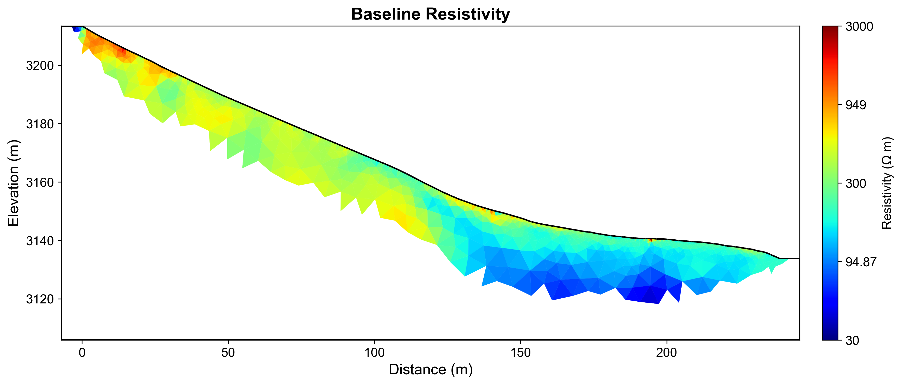
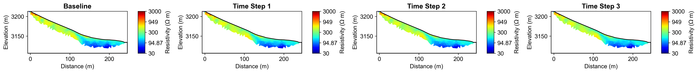
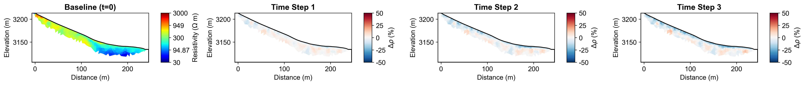
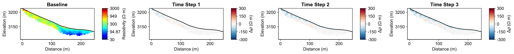
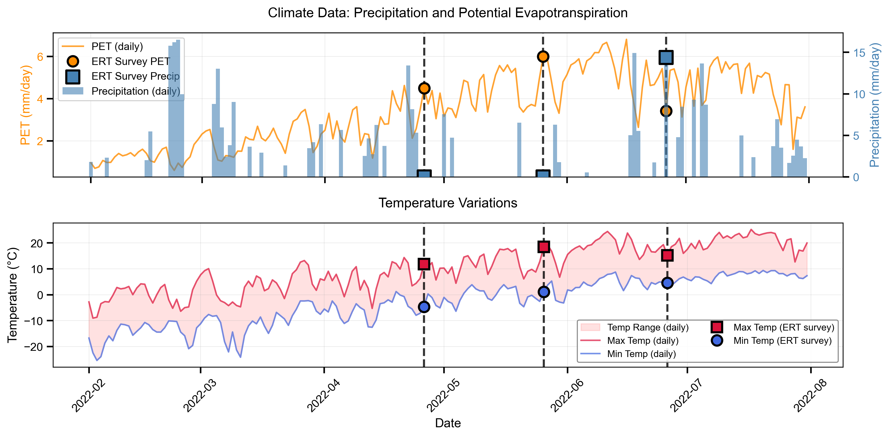

# Time-Lapse ERT Monitoring Report

**Report Generation Date:** 2025-11-08 19:52:03

## Executive Summary

### Site Information
- **Location:** Mt. Snodgrass Monitoring Site, Near Crested Butte, Colorado, USA
- **Coordinates:** 38.92584°N, -106.97998°W
- **Elevation:** 3,150 meters
- **Study Period:** 2022-02-01 to 2022-07-31

### Monitoring Objective
Time-lapse ERT monitoring with climate integration for subsurface moisture dynamics.

### Method and Configuration
- **Time-Lapse Method:** Difference Inversion
- **Number of Time Steps:** 4
- **Temporal Regularization:** 100
- **Inversion Quality (χ²):** 60.492 (mean)

## Integrated Analysis and Interpretation

### Time-Lapse ERT Monitoring Report: Mt. Snodgrass Monitoring Site

#### Monitoring Objectives and Site Characteristics

The primary objective of the time-lapse Electrical Resistivity Tomography (ERT) monitoring at the Mt. Snodgrass site, located near Crested Butte, Colorado, was to investigate subsurface moisture dynamics over a six-month period from February to July 2022. This site, situated at an elevation of 3,150 meters, presents a unique environment for studying the interplay between hydrological processes and climate conditions. The monitoring aimed to quantify resistivity changes associated with moisture infiltration and drying, offering insights into the hydrological response to climatic variations, particularly during a season marked by fluctuating precipitation and temperature.

#### Time-Lapse Inversion Approach and Key Findings

The time-lapse ERT data were processed using the difference inversion method, which effectively captures absolute resistivity changes across four distinct time steps. The inversion results indicated a baseline resistivity of 318.06 Ω·m, with significant fluctuations detected over the monitoring period. The inversion quality, as assessed by the chi-squared values, demonstrated a marked improvement, with values decreasing from 385.388 at the initial time step to a stable range around 5.4 in the subsequent steps. Notably, the resistivity changes revealed a mean decrease of -34.75 Ω·m by the final measurement, with maximum decreases indicating substantial moisture infiltration (up to -275.63 Ω·m), while minor increases reflected drying conditions.

#### Climate Data Insights and Resistivity Changes

The integration of climate data, encompassing precipitation, temperature, and potential evapotranspiration (PET), provided essential context for interpreting the observed resistivity changes. During the monitoring period, total precipitation was recorded at 14.4 mm, with a maximum daily precipitation event contributing significantly to moisture dynamics. The analysis revealed a strong negative correlation between daily precipitation and resistivity changes (r = -0.763), indicating that increased moisture from precipitation correlates with lower resistivity values. Additionally, the mean temperature recorded a range from -0.3 to 14.6 °C, demonstrating a strong negative correlation with resistivity changes (r = -0.947). This suggests that as temperatures rise, the drying effects increase resistivity, thereby elucidating the dual influence of precipitation and temperature on subsurface moisture conditions.

#### Correlations, Patterns, and Recommendations

The findings suggest distinct patterns in subsurface moisture response to climatic variables, with the most significant anomalies observed following precipitation events. The correlation analysis indicates that resistivity changes are closely tied to the hydrological balance, particularly during periods of increased precipitation. Given the strong relationships identified, continued monitoring is recommended to further elucidate the temporal dynamics of subsurface moisture. Future investigations should also consider deploying additional ERT surveys during critical climatic events to capture immediate responses in resistivity changes. This approach will enhance our understanding of moisture dynamics in relation to climate variability and inform water resource management strategies in high-elevation environments.

## Time-Lapse Inversion Results

### Methodology

The **difference inversion** method calculates absolute resistivity changes between 
each time step and the baseline survey. This approach is optimal for detecting 
localized changes and quantifying moisture infiltration or drying processes.

### Inversion Parameters
- **Number of Time Steps:** 4
- **Temporal Regularization (α):** 100
- **Spatial Regularization (λ):** N/A
- **Maximum Iterations:** N/A
- **Solver Method:** DIFFERENCE

### Convergence and Data Fit

**Chi-Squared Values by Time Step:**
- Time Step 1: χ² = 385.388
- Time Step 2: χ² = 10.301
- Time Step 3: χ² = 6.130
- Time Step 4: χ² = 5.404
- Time Step 5: χ² = 5.408
- Time Step 6: χ² = 5.406
- Time Step 7: χ² = 5.405

### Temporal Resistivity Statistics

**Baseline Resistivity (Time Step 1):**
- Mean: 318.06 Ω·m
- Range: [17.34, 2632.13] Ω·m
- Standard Deviation: 191.12 Ω·m

**Resistivity Changes (Relative to Baseline):**

**Time Step 2:**
- Mean Change: -11.57 Ω·m
- Maximum Decrease: -132.37 Ω·m (moisture increase)
- Maximum Increase: 37.33 Ω·m (drying/freezing)

**Time Step 3:**
- Mean Change: -26.79 Ω·m
- Maximum Decrease: -222.24 Ω·m (moisture increase)
- Maximum Increase: 41.69 Ω·m (drying/freezing)

**Time Step 4:**
- Mean Change: -34.75 Ω·m
- Maximum Decrease: -275.63 Ω·m (moisture increase)
- Maximum Increase: 47.53 Ω·m (drying/freezing)

## Climate Data Integration

### Meteorological Context

**Climate Data Summary:**
- **Date Range:** ['2022-02-01', '2022-07-31']
- **Variables:** prcp, tmin, tmax, srad, dayl
- **PET Method:** Penman-Monteith
- **Time Scale:** Daily
- **Region:** NA

**ERT Survey Alignment:**
- Number of ERT Surveys: 4
- Survey Dates: 2022-03-26, 2022-04-26, 2022-05-26, 2022-06-26

**Climate Conditions at ERT Survey Times:**

- **Precipitation:** Total = 14.4 mm, Max daily = 14.4 mm
- **Temperature:** Mean range = [-0.3, 14.6] °C
- **Potential ET:** Mean = 4.32 mm/day, Total = 17.3 mm

## Climate-Resistivity Correlation Analysis

### Cross-Modal Analysis

This section examines the relationship between temporal resistivity changes and 
meteorological variables to understand subsurface moisture dynamics.

### Correlation Coefficients

Correlation between mean resistivity changes and climate variables:

- **Daily Precipitation:** r = -0.763
- **7-day Antecedent Precipitation:** r = nan
- **Mean Temperature:** r = -0.947
- **Moisture Balance (P-PET):** r = nan

### Interpretation Guidelines

- **Negative correlation (r < 0):** Resistivity decreases as the variable increases
  - Expected for precipitation: more water → lower resistivity
- **Positive correlation (r > 0):** Resistivity increases as the variable increases
  - Expected for temperature/PET: drying → higher resistivity
- **Strong correlation (|r| > 0.7):** Variable likely has significant influence
- **Weak correlation (|r| < 0.3):** Variable has minimal direct influence

### Key Findings

- **Strongest correlation:** Daily Precipitation (r = -0.763)
  - This indicates a **strong relationship** between resistivity changes and daily precipitation

## Visualizations

### Baseline Resistivity

### Timelapse All Resistivity

### Timelapse Changes Percent

### Timelapse Changes Absolute

### Climate Correlation

## Summary and Recommendations

### Key Findings Summary

Based on the time-lapse ERT monitoring and climate data integration:

1. **Temporal Resistivity Changes:** Systematic changes in subsurface resistivity were 
   observed over the monitoring period, indicating dynamic moisture conditions.

2. **Climate-Resistivity Relationships:** Correlations between meteorological variables 
   and resistivity changes provide insights into subsurface hydrological processes.

3. **Data Quality:** Inversion results show good convergence, indicating reliable 
   monitoring of subsurface changes.

### Recommendations for Future Monitoring

1. **Continue Time-Series:** Extend monitoring to capture seasonal cycles and longer-term trends
2. **Enhanced Climate Integration:** Consider additional variables (snow depth, soil temperature)
3. **Depth-Dependent Analysis:** Investigate how climate effects vary with depth
4. **Validation:** Compare with direct measurements (soil moisture sensors, neutron probes)
5. **Predictive Modeling:** Use established correlations for forecasting subsurface response

---

**Site:** Mt. Snodgrass Monitoring Site  
**Report Generated:** 2025-11-08 19:52:23  
**Generated by:** PyHydroGeophysX Multi-Agent System
