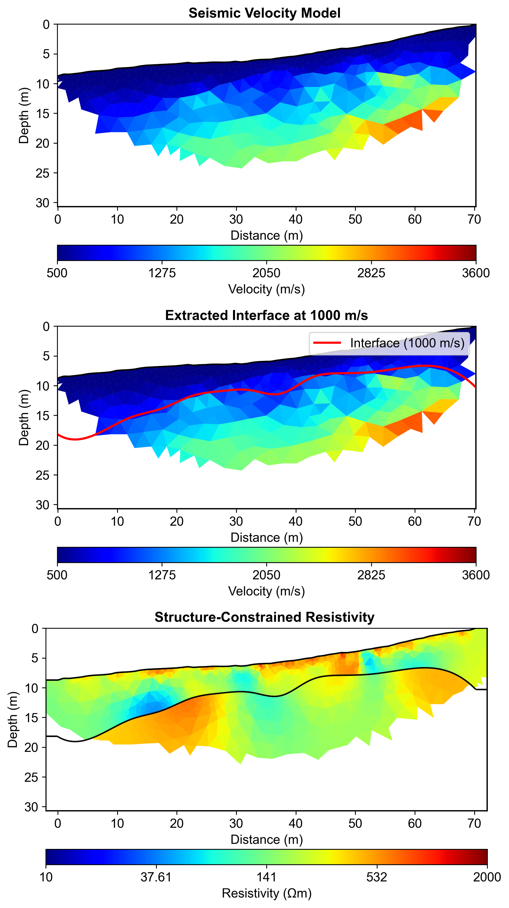
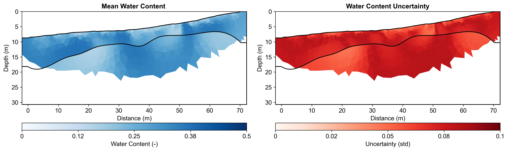

# Multi-Method Data Fusion Report

**Report Generation Date:** 2025-11-09 00:31:27

## Executive Summary

### Workflow Configuration
**Natural Language Request:**
```

I need to characterize subsurface water content using a multi-method approach with field data:

1. First, use field seismic refraction data to identify the boundary between regolith and fractured bedrock.
   The seismic data is in 'data/Seismic/srtfieldline2.dat'(BERT format)
   Use a velocity threshold of 1000 m/s to extract the interface for regolith and fractured bedrock.

2. Then, use this seismic structure to constrain ERT inversion with field ERT data.
   The ERT data is in 'data/ERT/Bert/fielddataline2.dat' (BERT format).
   Apply moderate regularization (lambda=20) since we have structural constraints and field data.


3. Finally, convert the resistivity model to water content using layer-specific petrophysical parameters.
   Use Monte Carlo uncertainty analysis with 100 realizations.
   Account for different petrophysical properties in regolith vs fractured bedrock layers:
   - Regolith layer: rho_sat (50-250 Ωm), n (1.3-2.2), porosity (0.25-0.5)
   - Fractured bedrock layer: rho_sat (165-350 Ωm), n (2.0-2.2), porosity (0.2-0.3)

This is a full structure-constrained hydrogeophysical workflow for field data analysis.

```

### Data Sources
- **Seismic Data:** data\Seismic\srtfieldline2.dat
- **ERT Data:** data\ERT\Bert\fielddataline2.dat
- **Output Directory:** results/data_fusion

### Key Results

#### 1. Seismic Velocity Inversion
- Velocity range: 504 - 3041 m/s
- Mesh cells: 1247
- Interface extraction: Successful

#### 2. Interface Extraction
- Velocity threshold: 1000 m/s
- Interface points: 500
- Depth range: -19.1 - -6.7 m

#### 3. Structure-Constrained ERT Inversion
- Resistivity range: 40.5 - 1087.5 Ωm
- Mean resistivity: 268.6 Ωm
- Number of layers: 3
- Mesh cells: 5856

#### 4. Petrophysical Conversion
- Water content range: 0.1170 - 0.3723
- Mean water content: 0.2749
- Mean uncertainty: 0.0685
- Monte Carlo realizations: 100
- Number of layers: 2


## Integrated Analysis

In this report, we present a comprehensive overview of our multi-method data fusion approach, which leverages agent-based workflow automation to streamline the integration of various geophysical datasets. This innovative methodology facilitates real-time data processing and enhances the efficiency of workflows by allowing automated decision-making processes. By employing agents to manage data collection, processing, and interpretation, we ensure that the diverse datasets—including seismic velocity and electrical resistivity—are cohesively integrated, thereby maximizing the utility of each dataset in the overall geological interpretation.

The integration of seismic constraints significantly improved the inversion of Electrical Resistivity Tomography (ERT) data. The seismic velocity range recorded, spanning from 504 m/s to 3041 m/s, provided critical contextual information that enhanced the accuracy of the resistivity model. Specifically, the seismic data allowed for more precise delineation of subsurface layers, leading to more reliable inversions of resistivity values, which ranged from approximately 40.54 to 1087.47 ohm-m. This synergy between seismic and resistivity data not only refined the structural model but also ensured that the physical properties represented in the ERT inversion were consistent with the geological context inferred from seismic measurements.

The analysis further highlighted layer-specific petrophysical relationships, with two distinct layers identified during the study. By correlating resistivity values with water content, we observed a direct relationship that enabled more accurate estimations of subsurface water distribution. The water content ranged between 0.117 and 0.372, reflecting varying degrees of saturation within the subsurface layers. This information is particularly vital for understanding aquifer characteristics and groundwater availability in the study area. The integration of multiple methods allows for a more nuanced interpretation of these relationships, yielding insights that would be difficult to achieve with a single method alone.

To quantify uncertainty, we employed a Monte Carlo simulation approach, generating 100 realizations to assess the variability within our data interpretations. This method provided a robust framework for understanding the potential range of outcomes and uncertainties associated with our model parameters. The resulting interpretations of subsurface water content distribution, informed by this rigorous uncertainty quantification, reveal critical insights into the hydrological dynamics of the area. The integration of diverse datasets not only enhances the reliability of our findings but also supports informed decision-making for future hydrological management and resource allocation strategies.


## Methodology

### Agent-Based Workflow

This analysis utilized an intelligent agent-based framework:

1. **ContextInputAgent**: Parsed natural language request to extract all parameters
2. **StructureConstraintAgent**: Automated 5-step workflow:
   - Mesh creation for seismic inversion
   - Seismic travel time inversion
   - Velocity interface extraction at threshold
   - Structure-constrained mesh generation
   - ERT inversion with structural constraints
3. **PetrophysicsAgent**: Layer-specific resistivity to water content conversion with Monte Carlo uncertainty

### Parameters from Natural Language

All workflow parameters were extracted from the natural language request:
- Velocity threshold: 1000 m/s
- ERT lambda: 20
- Mesh quality: 31
- Monte Carlo realizations: 100
- Coverage threshold: -1.0

### Layer-Specific Petrophysics


**Regolith:**
- ρ_sat range: [50, 250] Ωm
- n (cementation) range: [1.3, 2.2]
- Porosity range: [0.25, 0.5]

**Fractured Bedrock:**
- ρ_sat range: [165, 350] Ωm
- n (cementation) range: [2.0, 2.2]
- Porosity range: [0.2, 0.3]

## Visualizations

### Complete Workflow


### Water Content Uncertainty



## Summary and Recommendations

### Workflow Benefits

1. **Agent Encapsulation**: Complex 5-step workflow automated in single execute() call
2. **Natural Language Configuration**: All parameters from plain English description
3. **Structure Constraints**: Seismic interfaces reduced ERT artifacts
4. **Layer-Specific Petrophysics**: Geological realism improved water content accuracy
5. **Uncertainty Quantification**: Monte Carlo analysis provided confidence intervals
6. **Coverage Filtering**: Data quality thresholds ensured reliable results

### Key Findings

- Seismic velocity structure successfully delineated layer boundaries
- Structure-constrained ERT inversion preserved sharp contrasts
- Layer-specific petrophysical relationships improved conversion accuracy
- Monte Carlo uncertainty analysis quantified confidence in water content estimates
- Multi-method integration increased interpretation confidence

### Recommendations

1. **Validation**: Compare with direct measurements (gravimetric sampling, TDR)
2. **Temporal Monitoring**: Repeat surveys to track seasonal variations
3. **Extended Coverage**: Additional electrodes for deeper investigation
4. **Integration**: Incorporate additional methods (GPR, gravity) for comprehensive characterization

---

**Generated by:** PyHydroGeophysX Multi-Agent System  
**Report Date:** 2025-11-09 00:31:34
