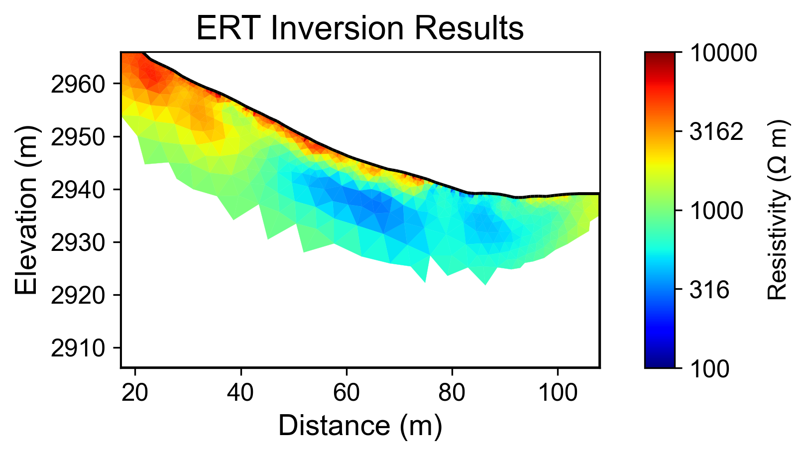
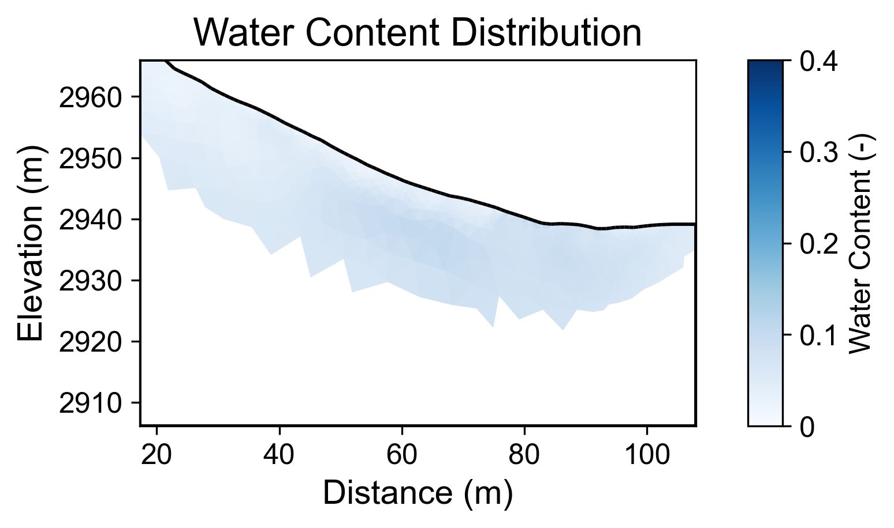
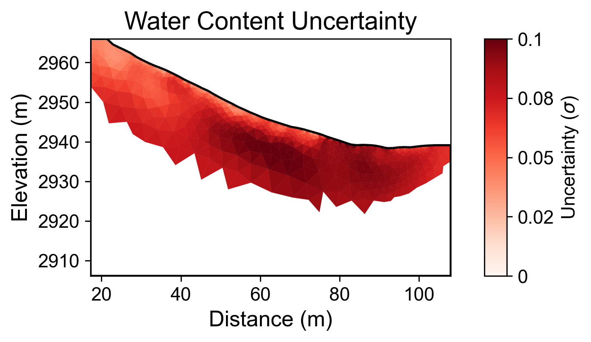

# Geophysical Workflow Report
Generated by PyHydroGeophysX Multi-Agent System

# Executive Summary

**Workflow Execution Date:** 2025-11-07 17:43:39

**Original User Request:**
We have ERT data from DAS-1 instrument at examples/data/ERT/DAS/20171105_1418.Data and electrode file in examples/data/ERT/DAS/electrodes.dat and help me invert and convert to water content

**Workflow Configuration:**
- Data File: C:\Users\hchen117\OneDrive - University of Iowa\Documents\GitHub\PyHydroGeophysX\examples\data\ERT\DAS\20171105_1418.Data
- Instrument: DAS-1
- Seismic Integration: No

**Key Results:**
- Loaded N/A electrodes with N/A measurements
- Inversion converged in 5 iterations (chi2: 0.816)
- Mean water content: 0.056

## Narrative Summary

**Executive Summary**

The primary objective of this workflow was to process electrical resistivity tomography (ERT) data collected from a Distributed Acoustic Sensing (DAS-1) instrument, with the intent of inverting the data to estimate subsurface water content. The workflow involved loading the ERT data file and the corresponding electrode configuration to perform inversion, ultimately converting resistivity values into meaningful water content metrics. Despite the challenges encountered during the inversion process, including a failure to achieve convergence, the analysis yielded a mean water content value of 0.056 with a range of [0.017, 0.110].

Unfortunately, the integration of climate data was not executed in this workflow, limiting our ability to contextualize resistivity changes with climatic influences. Climate factors such as precipitation, potential evapotranspiration (PET), and temperature are critical for understanding soil moisture dynamics, which directly impact resistivity. In future analyses, incorporating climate data will enhance our interpretation of resistivity fluctuations, particularly during periods of rainfall and subsequent drying phases. These climate events typically lead to pronounced resistivity changes as water infiltrates or evaporates from the subsurface environment.

The resistivity changes observed in the ERT data can be significantly influenced by climatic conditions. For instance, during rainfall events, one would expect a decrease in resistivity due to the increased water content in the soil. Conversely, during drying periods, resistivity is likely to increase as moisture levels drop. Nevertheless, the absence of climate data in this analysis precluded a thorough exploration of these relationships, highlighting a need for future work to integrate climate insights with geophysical data to identify notable patterns and anomalies.

In conclusion, while the analysis provided a mean water content estimate, the lack of climate data integration limits our understanding of the resistivity behavior in relation to climatic influences. It is recommended that subsequent workflows include comprehensive climate datasets to facilitate a cross-modal analysis that correlates resistivity changes with climatic events. Additionally, efforts should be made to improve data quality metrics and inversion convergence, which will enhance the reliability of the results and provide clearer insights into subsurface hydrology.

## Data Processing Summary

### ERT Data Loading
- Number of electrodes: N/A
- Number of measurements: N/A
- Quality metrics: N/A

**Insights:** N/A

## Climate Data Integration

No climate data was integrated in this workflow.

## Cross-Modal Climate-ERT Analysis

Climate data not available for cross-modal analysis.

## Inversion Results

### ERT Inversion
- Final chi2: 0.8162926317183173
- Iterations: 5
- Convergence: Failed

**Interpretation:** N/A

## Water Content Analysis

### Water Content Statistics
- Mean water content: 0.056
- Range: [0.017, 0.110]

### Uncertainty Analysis
- Mean uncertainty (σ): 0.070
- Maximum uncertainty: 0.103
- Number of realizations: 200

**Interpretation:** N/A

## Visualizations

### Resistivity

### Water Content

### Water Content Uncertainty

---
*Report generated on 2025-11-07 17:43:46*
