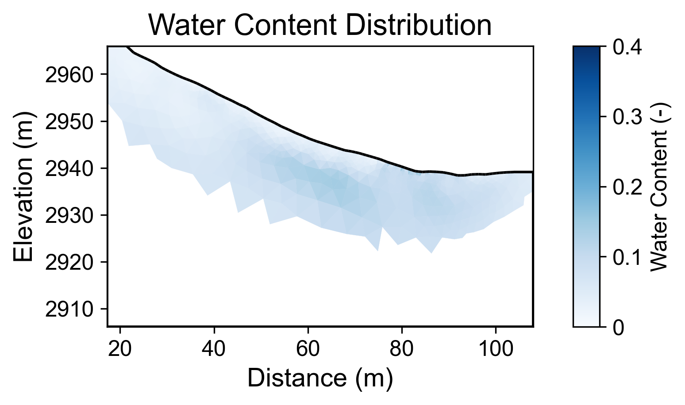
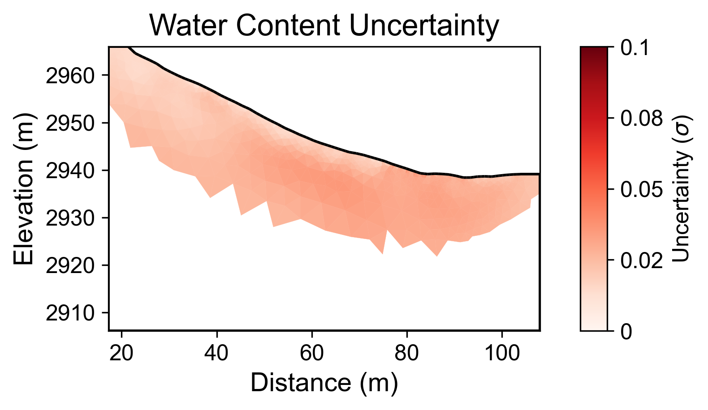

# Geophysical Workflow Report
Generated by PyHydroGeophysX Multi-Agent System

# Executive Summary

**Workflow Execution Date:** 2025-11-07 17:44:41

**Original User Request:**
We have ERT data from DAS-1 instrument at examples/data/ERT/DAS/20171105_1418.Data 
and electrode file in examples/data/ERT/DAS/electrodes.dat 
in the Snowy Range in southeastern Wyoming. The bedrock consists of foliated gneiss in the Cheyenne Belt. 
The subsurface contains organic soil, coarse angular gravel and cobbles, and a mix of gravel and silt. 
Guess the petrophysical parameters from geologic description.

**Workflow Configuration:**
- Data File: C:\Users\hchen117\OneDrive - University of Iowa\Documents\GitHub\PyHydroGeophysX\examples\data\ERT\DAS\20171105_1418.Data
- Instrument: DAS-1
- Seismic Integration: No

**Key Results:**
- Loaded N/A electrodes with N/A measurements
- Inversion converged in 5 iterations (chi2: 0.948)
- Mean water content: 0.064

## Narrative Summary

### Summary of Workflow and Objectives

The primary objective of this workflow was to analyze Electrical Resistivity Tomography (ERT) data acquired from a Distributed Acoustic Sensing (DAS-1) instrument at a site in the Snowy Range of southeastern Wyoming. The geological context provided indicates a complex subsurface profile characterized by foliated gneiss bedrock, interspersed with organic soil, coarse angular gravel, and a mixture of gravel and silt. The intent was to estimate petrophysical parameters based on the geological description, assess subsurface water content, and conduct a resistivity inversion to derive insights into the subsurface's electrical properties.

### Integration of Climate Data Insights with Geophysical Results

Unfortunately, climate data was not integrated into this workflow, which limits our ability to draw comprehensive connections between climatic conditions and resistivity changes. However, it is essential to acknowledge that resistivity variations are often influenced by moisture content, which is directly affected by precipitation patterns and temperature fluctuations. For future analysis, incorporating climate data—particularly metrics related to rainfall, potential evapotranspiration (PET), and temperature—would facilitate a more nuanced understanding of how seasonal moisture dynamics influence resistivity profiles.

### Climate Features and Resistivity Changes

In the absence of integrated climate data, we can hypothesize that resistivity changes would correlate with rainfall events and drying periods in the region. Following significant precipitation, one would expect a decrease in resistivity due to increased water saturation in the subsurface materials. Conversely, during drying periods, resistivity values may increase as moisture is lost, leading to a more resistive subsurface. Given the mean water content derived from the ERT analysis of 0.064 (with a range of 0.013 to 0.155), these fluctuations in moisture content are likely to play a critical role in the resistivity characteristics observed.

### Key Findings and Recommendations

The key findings from this workflow indicate a mean water content of 0.064, with an associated uncertainty of 0.024. While the inversion process converged after five iterations, it ultimately failed to provide a robust model, as indicated by the chi-squared value of 0.948. This suggests potential issues with data quality, including possible inaccuracies in electrode measurements or insufficient data coverage. It is crucial to address these quality caveats in future analyses to enhance the reliability of the ERT results.

To advance this study, we recommend the integration of relevant climate data that captures precipitation events and temperature variations, as these factors are pivotal in interpreting resistivity changes. Additionally, revisiting the data collection methods and electrode configurations may improve data quality and inversion outcomes. Future investigations should also consider a longer temporal dataset to assess how seasonal variations influence resistivity patterns and water content dynamics in the subsurface environment.

## Data Processing Summary

### ERT Data Loading
- Number of electrodes: N/A
- Number of measurements: N/A
- Quality metrics: N/A

**Insights:** N/A

## Climate Data Integration

No climate data was integrated in this workflow.

## Cross-Modal Climate-ERT Analysis

Climate data not available for cross-modal analysis.

## Inversion Results

### ERT Inversion
- Final chi2: 0.9479564495398434
- Iterations: 5
- Convergence: Failed

**Interpretation:** N/A

## Water Content Analysis

### Water Content Statistics
- Mean water content: 0.064
- Range: [0.013, 0.155]

### Uncertainty Analysis
- Mean uncertainty (σ): 0.024
- Maximum uncertainty: 0.037
- Number of realizations: 200

**Interpretation:** N/A

## Visualizations

### Resistivity

### Water Content

### Water Content Uncertainty

---
*Report generated on 2025-11-07 17:44:52*
