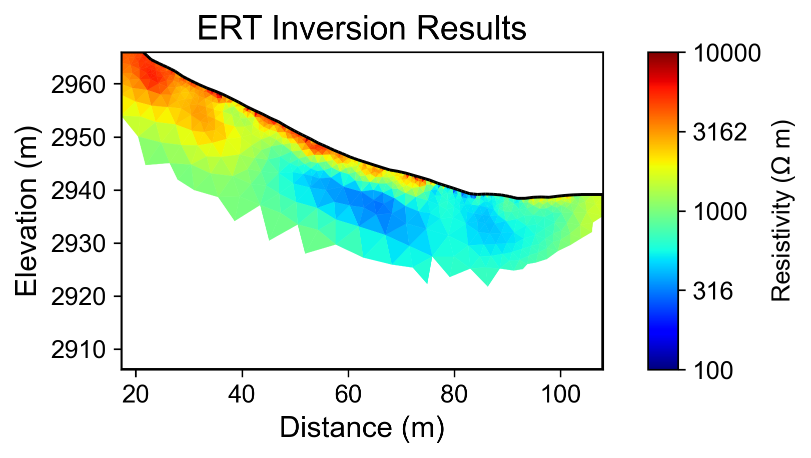
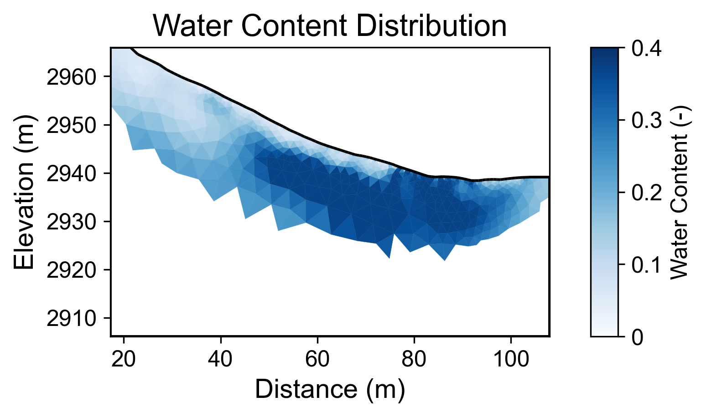
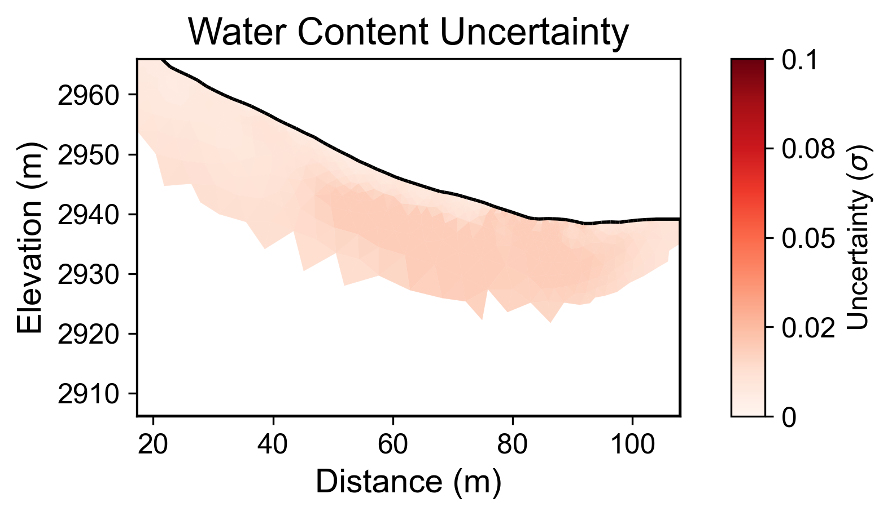

# Geophysical Workflow Report
Generated by PyHydroGeophysX Multi-Agent System

# Executive Summary

**Workflow Execution Date:** 2025-11-07 17:45:40

**Original User Request:**
We have ERT data from DAS-1 instrument at examples/data/ERT/DAS/20171105_1418.Data 
and electrode file in examples/data/ERT/DAS/electrodes.dat 
in the Snowy Range in southeastern Wyoming. The bedrock consists of foliated gneiss in the Cheyenne Belt. 
Use specific petrophysical parameters: rho_sat = 541, porosity = 0.37, n = 1.24

**Workflow Configuration:**
- Data File: C:\Users\hchen117\OneDrive - University of Iowa\Documents\GitHub\PyHydroGeophysX\examples\data\ERT\DAS\20171105_1418.Data
- Instrument: DAS-1
- Seismic Integration: No

**Key Results:**
- Loaded N/A electrodes with N/A measurements
- Inversion converged in 5 iterations (chi2: 0.948)
- Mean water content: 0.205

## Narrative Summary

### Summary of ERT Data Processing and Climate Insights

The objective of this workflow was to process Electrical Resistivity Tomography (ERT) data collected from a Distributed Acoustic Sensing (DAS-1) instrument in the Snowy Range of southeastern Wyoming. The study aimed to characterize subsurface hydrological properties, particularly focusing on the resistivity of the bedrock, which is primarily composed of foliated gneiss in the Cheyenne Belt. The specific petrophysical parameters utilized in the inversion process included a saturated resistivity (ρ_sat) of 541 ohm-m, a porosity of 0.37, and a cementation exponent (n) of 1.24. The workflow proceeded with data loading, inversion, and water content analysis to elucidate the subsurface hydrological conditions.

Despite the absence of integrated climate data in this specific workflow, understanding the climatic context is crucial for interpreting the resistivity results. Typically, resistivity variations in the subsurface can be influenced by changes in moisture content, which are directly affected by climatic factors such as precipitation, potential evapotranspiration (PET), and temperature. In this region, periods of significant rainfall can lead to increased water saturation in the subsurface, resulting in lower resistivity values. Conversely, during drying periods, reduced moisture levels can lead to higher resistivities. While the current dataset did not allow for direct climate integration, it is essential to consider these relationships in future analyses.

Key findings from the ERT inversion indicate a mean water content of 0.205, with a range from 0.031 to 0.371. The inversion converged after five iterations, though a convergence failure was noted, suggesting potential issues with data quality or model assumptions. The mean uncertainty in the water content estimation was relatively low at 0.012, with a maximum of 0.019, indicating a reasonably reliable estimate of subsurface moisture. However, the lack of detailed quality metrics, such as the number of electrodes and measurements, limits the robustness of these findings and warrants caution in their interpretation.

Moving forward, it is recommended to integrate climate data into future workflows to enhance the understanding of resistivity changes in the context of hydrological and climatic interactions. Collecting and analyzing precipitation, PET, and temperature data alongside ERT measurements will provide a more comprehensive view of the subsurface dynamics. Additionally, further investigation into the inversion process is warranted to address the convergence issues and improve the overall reliability of the results. Establishing a clearer link between climatic variables and resistivity changes will ultimately enrich the dataset and support informed decision-making in hydrological studies.

## Data Processing Summary

### ERT Data Loading
- Number of electrodes: N/A
- Number of measurements: N/A
- Quality metrics: N/A

**Insights:** N/A

## Climate Data Integration

No climate data was integrated in this workflow.

## Cross-Modal Climate-ERT Analysis

Climate data not available for cross-modal analysis.

## Inversion Results

### ERT Inversion
- Final chi2: 0.9479564513315801
- Iterations: 5
- Convergence: Failed

**Interpretation:** N/A

## Water Content Analysis

### Water Content Statistics
- Mean water content: 0.205
- Range: [0.031, 0.371]

### Uncertainty Analysis
- Mean uncertainty (σ): 0.012
- Maximum uncertainty: 0.019
- Number of realizations: 200

**Interpretation:** N/A

## Visualizations

### Resistivity

### Water Content

### Water Content Uncertainty

---
*Report generated on 2025-11-07 17:45:49*
